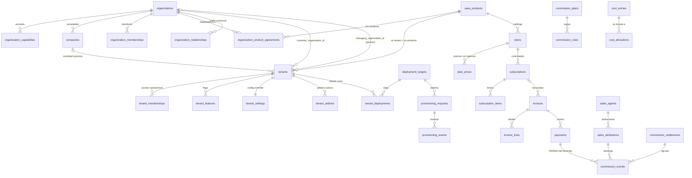

# Modelo de datos — schema `platform`

Todas las tablas viven en el schema `platform`. `public` no contiene negocio.

## 1. ERD (Mermaid)

## 2. Responsabilidad de cada tabla

### Identidad y acceso

| Tabla | Responsabilidad |
|---|---|
| `profiles` | Espejo público de `auth.users`. `auth.users` nunca se expone a PostgREST. |
| `platform_admins` | Roles de consola EBIM. Un trigger impide que `EBIM_SUPER_ADMIN` recaiga en alguien distinto de `dcalagua@ebim.pe`. |
| `organization_memberships` | Usuario ↔ organización + rol. Un trigger bloquea correos `@ebim.pe` en organizaciones cliente. |
| `tenant_memberships` | Acceso **operacional** a un tenant. Vender un tenant NO crea una fila aquí. |

### Cuentas y catálogo

| Tabla | Responsabilidad |
|---|---|
| `organizations` | La cuenta que compra y se factura. `kind` sólo separa EBIM del resto. |
| `organization_capabilities` | PARTNER / RESELLER / CONSULTING / CUSTOMER, acumulables. |
| `organization_relationships` | Aristas MANAGES / RESELLS_TO / SUBCONTRACTS con vigencia. |
| `companies` | Sociedad legal multipaís bajo la cuenta. `erp_code` es atributo, **nunca** clave. |
| `saas_products` | Catálogo. Un producto nuevo es una FILA. |
| `organization_product_agreements` | Qué SaaS puede comercializar/administrar una organización y con qué margen. Un partner multi-SaaS tiene N filas con condiciones distintas. |
| `catalog_items` | Addons y conectores. **Aquí vive el precio**, y `authenticated` no tiene GRANT de escritura. |
| `tenant_addons` | Activación por tenant. No tiene columna de precio: esa es la separación que exige el contrato §2.6. |
| `workspace_apps` | Qué apps tiene activas una cuenta. Alimenta también la vitrina cruzada (§6.1). |

### Tenancy y configuración

| Tabla | Responsabilidad |
|---|---|
| `tenants` | Espacio de UN producto para UNA organización. `admin_email` es NOT NULL con CHECK. |
| `tenant_features` | Flags con `source` (PLAN / ADDON / MANUAL): explica **por qué** está encendido. |
| `tenant_settings` | Override de config del tenant (capa más específica). |
| `platform_defaults` / `org_config` / `company_config` | Config en 3 capas con deep merge, igual que el hub EBIM. |

### Comercial

| Tabla | Responsabilidad |
|---|---|
| `sales_agents` | Comercial independiente, de partner o interno. Puede no tener login ni organización. |
| `sales_attributions` | Quién se lleva el crédito, con vigencia y `attribution_pct`. Un trigger impide que las vigentes sumen >100%. |
| `commission_plans` / `commission_rules` | Reglas con vigencia. Nunca se editan retroactivamente. |
| `commission_events` | Devengo por un **cobro** concreto. `payment_id` es NOT NULL. |
| `commission_settlements` | Liquidación por comercial y periodo. |

### Finanzas gerenciales

| Tabla | Responsabilidad |
|---|---|
| `plans` / `plan_prices` | Catálogo comercial por producto y modo. Precios con vigencia. |
| `subscriptions` | Contrato recurrente. `tenant_id` NULL = licencia base de partner. |
| `subscription_items` | Líneas: licencia, implementation fee, infra fee, soporte, addons. |
| `invoices` / `invoice_lines` | Facturación de control. `is_recurring` separa MRR de one-time. |
| `payments` | Cobros. Confirmar uno dispara el devengo de comisión. |
| `cost_entries` / `cost_allocations` | Costo y su imputación con `weight` explícito. |

### Infraestructura y gobierno

| Tabla | Responsabilidad |
|---|---|
| `deployment_targets` | Metadata **segura** de un entorno. Sin credenciales: un trigger las rechaza. |
| `tenant_deployments` | Qué tenant vive en qué target. Un trigger valida la coherencia de modos. |
| `provisioning_requests` | Cola con máquina de estados e idempotencia. |
| `provisioning_events` | Timeline append-only con detalle sanitizado. |
| `audit_logs` | Bitácora append-only **real**: `authenticated` sólo tiene SELECT. |

## 3. Invariantes garantizadas por la base

Estas reglas no dependen de que el frontend se acuerde de aplicarlas.

| Invariante | Mecanismo | Test |
|---|---|---|
| Crear un tenant exige correo de administrador | `create_tenant()` lanza `ADMIN_EMAIL_REQUERIDO`; columna NOT NULL + CHECK | 02 · 1-2 |
| El correo del admin no puede ser del dominio operador | CHECK + validación en `create_tenant()` | 02 · 3 |
| `EBIM_SUPER_ADMIN` sólo para `dcalagua@ebim.pe` | Trigger `platform_admins_super_admin_guard` | 02 · 4-5 |
| `@ebim.pe` no es actor de negocio de un cliente | Trigger `org_memberships_operator_domain_guard` | 02 · 6 |
| Un tenant DEMO no tiene suscripción recurrente activa | Trigger `subscriptions_demo_guard` | 02 · 7-8 |
| Un partner sin acuerdo no administra tenants de ese producto | Trigger `tenants_manager_agreement_guard` | 02 · 9 |
| Coherencia tenant ↔ target (modo, producto, exclusividad) | Trigger `tenant_deployments_coherence_guard` | 02 · 10-12 |
| Un cobro no se confirma sobre factura DRAFT/VOID | Trigger `payments_invoice_status_guard` | 02 · 14 |
| Las atribuciones vigentes no superan el 100% | Constraint trigger diferido | — |
| Las imputaciones de un costo no superan el 100% | Constraint trigger diferido | — |
| No se guardan secretos en JSONB | Trigger `reject_secret_like_json` | — |
| Toda comisión proviene de un pago confirmado | `payment_id` NOT NULL + lógica de `generate_commission_events` | 02 · 15 |
| Reprocesar un pago no duplica comisiones | Índice único de idempotencia | 02 · 18 |

## 4. Cifras del esquema

- **13 migraciones** versionadas (`supabase/migrations/`).
- **39 tablas** en `platform`, todas con RLS + FORCE.
- **7 vistas**, todas con `security_invoker = true`.
- **52 tests** pgTAP en 3 archivos.
