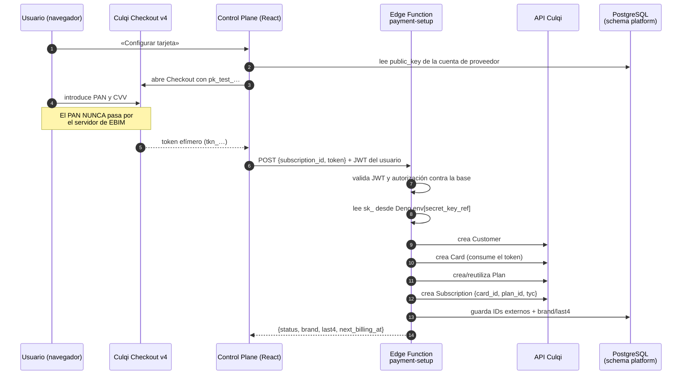
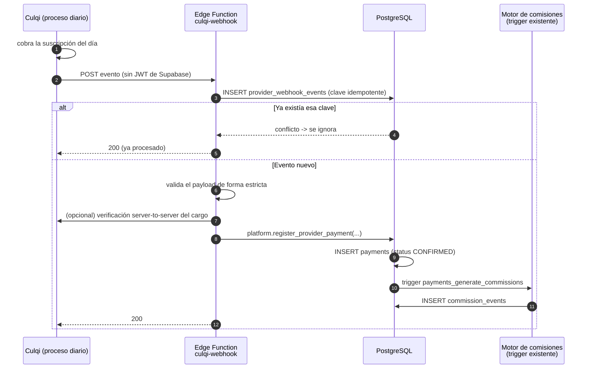

# Arquitectura de cobro con Culqi

> **Estado: DISEÑADO E IMPLEMENTADO EN MODO MOCK/TEST.**
> No se ha ejecutado ni un solo cobro LIVE. No hay credenciales Culqi configuradas
> en este proyecto. Ver §10 (checklist de activación) antes de afirmar lo contrario.

**Fecha:** 2026-09-07 · Fases 09 y 10 de `.claude-prompts-v2`.

---

## 1. Principio de diseño: Culqi es un proveedor, no el modelo

El dominio del Control Plane no sabe qué es Culqi. Sabe que una `subscription`
tiene un `collection_method` y, si ese método necesita una pasarela, una
`payment_provider_account`. Culqi es la primera implementación de un adapter, no
una dependencia del dominio.

Lo que eso significa en la práctica:

| El dominio conoce | El dominio NO conoce |
|---|---|
| `collection_method = 'CULQI_CARD'` | qué es un `sxn_` |
| `payments.status = 'CONFIRMED'` | el formato de un webhook de Culqi |
| `provider_subscriptions.external_subscription_id` (texto opaco) | que Culqi cobra los días 1 y 15 |

Cambiar a otro gateway = escribir otro `PaymentProvider` en
`supabase/functions/_shared/payments/` y crear otra `payment_provider_accounts`.
Ni una migración de dominio, ni un cambio en el motor de comisiones.

---

## 2. Objetos: local ↔ Culqi

Verificado contra la documentación oficial el 2026-09-07
(`docs.culqi.com/es/documentacion/pagos-online/recurrencia/suscripciones/*`).

Culqi crea los objetos **en este orden**: Plan → Customer → Card → Subscription.

| Concepto local | Tabla de mapeo | Objeto Culqi | Prefijo de id |
|---|---|---|---|
| `organizations` (cliente que paga) | `provider_customers` | Customer | `cus_(test\|live)_…` ¹ |
| Método de pago del cliente | `provider_payment_methods` | Card | `crd_(test\|live)_…` |
| `plans` + `plan_prices` | `provider_plans` | Plan | `pln_(test\|live)_…` |
| `subscriptions` | `provider_subscriptions` | Subscription | `sxn_(test\|live)_…` |
| `payments` | (referencia directa) | Charge | `chr_(test\|live)_…` |

¹ Los prefijos `pln_`, `sxn_`, `crd_` y `chr_` están documentados de forma
explícita. El de Customer **no aparece** en las páginas consultadas; el adapter
no depende de él (trata todos los ids externos como texto opaco), así que no se
afirma aquí como hecho verificado.

**Campos de creación de una suscripción**, verbatim de la documentación:

```json
{
  "card_id":  "crd_test_xxxxxxxxxxx",
  "plan_id":  "pln_test_xxxxxxxxxxx",
  "tyc":      true,
  "metadata": {}
}
```

`tyc` es la aceptación de términos y condiciones del titular. La UI debe
capturarla explícitamente; el adapter no la asume.

---

## 3. Llaves y entornos

Verbatim de `docs.culqi.com/es/documentacion/pagos-online/llaves`:

| Llave | Formato | Dónde vive | Qué puede hacer |
|---|---|---|---|
| Pública | `pk_(test\|live)_XXXX` | **Navegador**. "No son un secreto", "pueden publicarse con seguridad en tu Checkout, código JavaScript o en tu aplicación Android o iOS" | "solo tienen el poder de crear tokens" |
| Privada | `sk_(test\|live)_XXXX` | **Solo servidor**. "deben mantenerse de forma confidencial en tus servidores" | "pueden realizar cualquier petición al API sin ninguna restricción" |

Y un detalle operativo que condiciona el diseño:

> "Nuestra API sigue siendo la misma para ambos casos. Internamente enrutará a
> cada entorno dependiendo del tipo de llave usada (live o test)."

**Consecuencia:** el entorno NO se distingue por la URL, sino por la llave. Por
eso `payment_provider_accounts.environment` es un enum explícito (`TEST`/`LIVE`)
y no algo que se pueda deducir del endpoint. Una confusión aquí cobra de verdad
creyendo que está en pruebas.

### Dónde vive cada cosa en este proyecto

| Dato | Ubicación | Por qué |
|---|---|---|
| `pk_test_…` | `payment_provider_accounts.public_key` (columna) | Es pública por diseño; el navegador la necesita |
| `sk_test_…` / `sk_live_…` | **Supabase Edge Function secret** | Un `CHECK` de la tabla rechaza cualquier valor con forma `sk_`/`pk_` |
| Nombre de esa variable | `payment_provider_accounts.secret_key_ref` (ej. `CULQI_SECRET_KEY`) | La base sabe *dónde buscar*, no *qué es* |
| PAN, CVV, token de tarjeta | **En ningún sitio** | El PAN nunca toca nuestro servidor: lo tokeniza el navegador contra Culqi |
| `brand`, `last4`, `exp_month/year` | `provider_payment_methods` | No son datos de tarjeta reutilizables; sirven para que el usuario reconozca su medio de pago |

---

## 4. Flujo de alta de método de pago



Reglas que impone el diseño:

1. **El token es de un solo uso y efímero.** No se persiste, no se registra, no
   se devuelve al cliente. El adapter lo recibe, lo consume y lo olvida.
2. **La Edge Function exige JWT de usuario** y vuelve a comprobar la autorización
   contra la base. No basta con que la UI haya ocultado el botón.
3. **`sk_` se lee de `Deno.env`.** No se acepta por parámetro, no se registra en
   ningún log, no aparece en la respuesta.

---

## 5. Flujo de cobro recurrente y webhook



### 5.1 La limitación de seguridad, dicha con claridad

> **La documentación oficial de Culqi consultada el 2026-09-07 NO describe
> ninguna firma criptográfica ni cabecera HMAC para verificar la autenticidad de
> un webhook.**

La página de webhooks enumera las categorías de evento (Tokens, Cargos,
Devoluciones, Clientes, Tarjetas, Planes, Suscripciones, Órdenes) y explica cómo
configurar la URL en el CulqiPanel, pero **no ofrece mecanismo de verificación**.

**No se inventa una.** Firmar con un secreto que Culqi no envía sería teatro de
seguridad. En su lugar se aplican cuatro defensas reales:

| Defensa | Implementación | Qué ataque mitiga |
|---|---|---|
| **Idempotencia dura** | Índice único sobre `(provider_account_id, external_event_key)` | Repetición del mismo evento, sea por reintento legítimo o por un atacante |
| **Validación estricta del payload** | El adapter rechaza cualquier evento cuya forma no reconozca, en vez de intentar interpretarlo | Payloads inventados o malformados |
| **Verificación server-to-server** | Antes de confirmar un pago, el adapter puede consultar el cargo a Culqi con la `sk_` | Un tercero que invente un evento de cobro: no puede hacer que Culqi confirme un `chr_` que no existe |
| **Correlación obligatoria** | El evento tiene que referirse a una `provider_subscriptions` o `provider_payment_methods` que YA exista en nuestra base | Eventos de cuentas ajenas |

Además, el endpoint se despliega con `verify_jwt = false` (Culqi no puede enviar
un JWT de Supabase) pero **no escribe nada directamente**: todo pasa por
`platform.register_provider_payment()`, una RPC `SECURITY DEFINER` que valida
antes de tocar `payments`.

**Recomendación operativa para PRD:** restringir el endpoint por IP de origen si
Culqi publica su rango, y activar alertas sobre `provider_webhook_events` con
`status = 'REJECTED'`.

---

## 6. Idempotencia: por qué un webhook repetido 5 veces genera 1 pago

Tres capas, y cada una sobra para que la siguiente no se ejercite:

1. **`provider_webhook_events`** tiene `unique (provider_account_id, external_event_key)`.
   El segundo `INSERT` falla y la función devuelve 200 sin procesar.
2. **`payments.reference`** es único en el baseline. El pago se registra con
   `reference = 'culqi:' || chr_id`, así que el mismo cargo no puede entrar dos veces
   aunque llegue por otro camino (p. ej. la reconciliación manual).
3. **`commission_events`** tiene el índice
   `(payment_id, sales_attribution_id, commission_rule_id, coalesce(invoice_line_id, …))`
   del baseline, y `generate_commission_events()` usa `on conflict do nothing`.

Resultado verificable: 5 entregas del mismo evento ⇒ 1 fila en `payments` y 1
conjunto de `commission_events`. La Fase 16 lo comprueba con un test.

---

## 7. Modo sin credenciales (el modo por defecto hoy)

El adapter resuelve el proveedor así:

```
¿La cuenta declara secret_key_ref?           → no → MOCK
¿Existe Deno.env[secret_key_ref]?            → no → MOCK
¿environment = 'LIVE'?                       → sí → exige CULQI_ALLOW_LIVE=true
                                                    (si falta → error ruidoso)
                                             → no → CULQI TEST
```

El `MockCulqiProvider`:

- es **determinista**: los ids externos se derivan de un hash del input, así que
  el mismo alta produce el mismo `crd_mock_…` y los tests no dependen del azar;
- marca todos los ids con el prefijo `mock_` para que sea **imposible confundir**
  un dato simulado con uno real en la base;
- nunca hace red;
- devuelve `brand: 'VISA'`, `last4: '4242'` — valores obviamente de prueba.

La UI muestra «Culqi pendiente de configurar» cuando la cuenta no tiene
credenciales, en vez de fingir que el cobro está operativo.

**Lo que el modo MOCK NO valida:** que las credenciales reales funcionen, que el
formato del webhook real coincida, que el enrutado test/live sea el esperado, o
que los importes y monedas se acepten. Eso solo lo valida un test contra Culqi
TEST con credenciales, y eso está en el checklist de §10.

---

## 8. Reconciliación

`payment-reconcile` compara, para un rango de fechas:

| Comprobación | Estado resultante |
|---|---|
| Cargo en Culqi sin `payments` local | `MISSING_LOCAL` |
| `payments` local sin cargo en Culqi | `MISSING_PROVIDER` |
| Importes o moneda distintos | `AMOUNT_MISMATCH` |
| `provider_subscriptions.provider_status` distinto del estado local | `STATUS_DRIFT` |
| Todo cuadra | `OK` |

La función **no corrige nada automáticamente**: escribe el diagnóstico y lo deja
en la pantalla de Reconciliación. Un ajuste contable automático a partir de una
comparación es exactamente cómo se pierde la trazabilidad.

---

## 9. Fallos y estados

| Situación | Qué hace el sistema |
|---|---|
| Tarjeta rechazada en el alta | La Edge Function devuelve el mensaje sanitizado de Culqi; no se crea `provider_subscriptions` |
| Cobro recurrente fallido | Webhook → `PAYMENT_FAILURE` en `billing_alerts` (Fase 11). NO se crea `payments` |
| Culqi cancela la suscripción tras N fallos | `provider_subscriptions.provider_status = 'canceled'`; la reconciliación lo marca `STATUS_DRIFT` si la local sigue activa |
| Reverso / devolución | `payments.status = 'REVERSED'` + contra-evento de comisión (Fase 12). **No se borra nada** |
| Edge Function caída | Culqi reintenta; la idempotencia hace que el reintento sea seguro |
| Secreto ausente en LIVE | Error ruidoso en el arranque del adapter. Nunca degrada silenciosamente a MOCK en LIVE |

---

## 10. Checklist de activación en producción

Ninguno de estos puntos está hecho. **Mientras haya casillas sin marcar, el PRD
de Culqi NO está validado**, y así se declara en `FINAL_REPORT_V2.md`.

- [ ] Cuenta Culqi de comercio creada y verificada por el operador.
- [ ] `pk_test_…` cargada en `payment_provider_accounts.public_key` de `culqi-pe-test`.
- [ ] `CULQI_SECRET_KEY` (valor `sk_test_…`) cargada como **Edge Function secret**:
      `supabase secrets set CULQI_SECRET_KEY=sk_test_…`
- [ ] Confirmar la URL base de la API contra `https://apidocs.culqi.com/` y fijarla
      en `CULQI_API_BASE`. **El adapter no asume una por su cuenta**: si la variable
      falta, opera en MOCK.
- [ ] Prueba de alta de tarjeta con las tarjetas de prueba de Culqi.
- [ ] Prueba de cobro recurrente en TEST y verificación de que llega el webhook.
- [ ] Reenviar el mismo webhook 5 veces y comprobar 1 solo `payments` y 1 solo
      conjunto de `commission_events`.
- [ ] Prueba de cobro fallido y verificación de que genera alerta y NO genera pago.
- [ ] Prueba de devolución y verificación del contra-evento de comisión.
- [ ] Ejecutar `payment-reconcile` sobre el periodo de pruebas: debe salir `OK`.
- [ ] Revisar que `npm run secrets:scan` sigue en PASS con las credenciales cargadas
      (deben estar solo en secrets del servidor, nunca en el repo ni en `dist/`).
- [ ] Restringir el webhook por IP de origen si Culqi publica su rango.
- [ ] **Autorización explícita y por escrito del operador** para pasar a `sk_live_`.
- [ ] Crear la cuenta `culqi-pe-live` con `environment = 'LIVE'` y su
      `secret_key_ref`, y definir `CULQI_ALLOW_LIVE=true` en el entorno.

---

## 11. Fuentes consultadas

Solo documentación oficial (regla de la Fase 09: nada de blogs).

| Fuente | Qué se tomó de ella | Consultada |
|---|---|---|
| `docs.culqi.com/es/documentacion/pagos-online/llaves` | Formato `pk_`/`sk_`, dónde vive cada una, enrutado test/live por tipo de llave | 2026-09-07 |
| `docs.culqi.com/…/recurrencia/suscripciones/resumen/` | Orden de creación Plan → Customer → Card → Subscription; proceso diario y notificación por webhook; estados active/canceled | 2026-09-07 |
| `docs.culqi.com/…/recurrencia/suscripciones/suscripciones/` | Prefijos `pln_`, `sxn_`, `crd_`, `chr_`; campos `card_id`, `plan_id`, `tyc`, `metadata`; operaciones crear/consultar/listar/actualizar/cancelar | 2026-09-07 |
| `docs.culqi.com/es/documentacion/pagos-online/webhooks/` | Categorías de evento; **ausencia de firma criptográfica documentada** | 2026-09-07 |
| `apidocs.culqi.com` | Referenciada por la documentación como fuente de endpoints exactos. **No devolvió contenido legible en la consulta**, por lo que la URL base queda como variable de entorno a confirmar (§10) en vez de asumirse | 2026-09-07 |

### Diferencias respecto a lo que asumía el prompt

- El prompt daba por hecho que se podría fijar el endpoint exacto. La documentación
  oficial delega los endpoints en `apidocs.culqi.com`, que no fue legible desde
  esta sesión. **No se inventa una URL base**: es configuración (`CULQI_API_BASE`)
  y su ausencia degrada a MOCK.
- El prompt pedía "la máxima validación que Culqi soporte oficialmente" para el
  webhook. La respuesta honesta es: **no soporta ninguna firma documentada**, y
  el diseño lo compensa por idempotencia y verificación server-to-server (§5.1).
