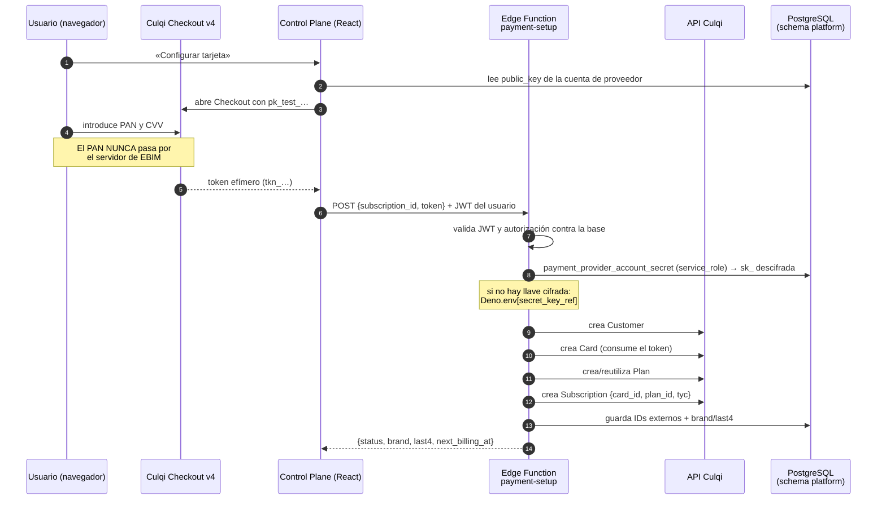
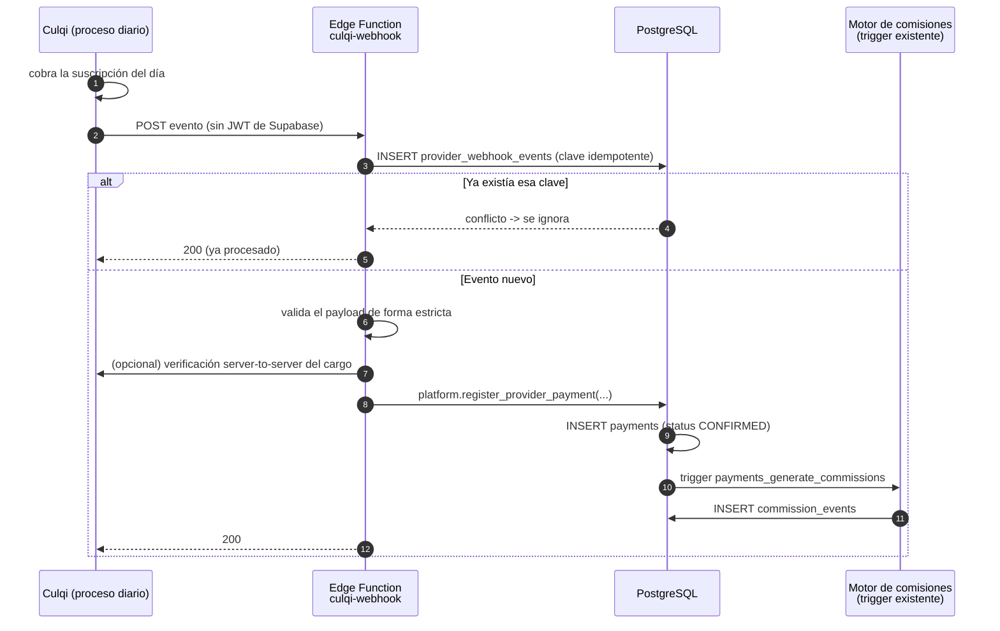
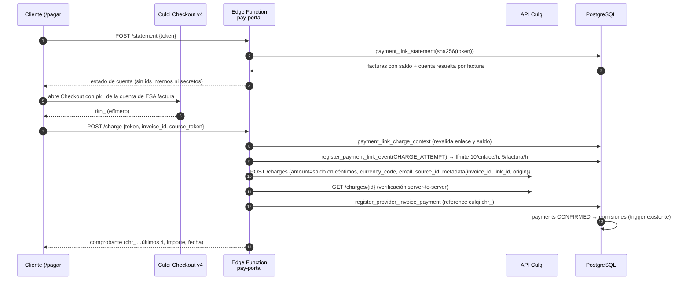

# Arquitectura de cobro con Culqi

> **Estado: DISEÑADO E IMPLEMENTADO EN MODO MOCK/TEST.**
> No se ha ejecutado ni un solo cobro LIVE. No hay credenciales Culqi configuradas
> en este proyecto. Ver §10 (checklist de activación) antes de afirmar lo contrario.

**Fecha:** 2026-09-07 · Fases 09 y 10 de `.claude-prompts-v2`.

---

## 1. Principio de diseño: Culqi es un proveedor, no el modelo

El dominio del Control Plane no sabe qué es Culqi. Sabe que una `subscription`
tiene un `collection_method` y, si ese método necesita una pasarela, una
`payment_provider_account`. Culqi es la primera implementación de un adapter, no
una dependencia del dominio.

Lo que eso significa en la práctica:

| El dominio conoce | El dominio NO conoce |
|---|---|
| `collection_method = 'CULQI_CARD'` | qué es un `sxn_` |
| `payments.status = 'CONFIRMED'` | el formato de un webhook de Culqi |
| `provider_subscriptions.external_subscription_id` (texto opaco) | que Culqi cobra los días 1 y 15 |

Cambiar a otro gateway = escribir otro `PaymentProvider` en
`supabase/functions/_shared/payments/` y crear otra `payment_provider_accounts`.
Ni una migración de dominio, ni un cambio en el motor de comisiones.

---

## 2. Objetos: local ↔ Culqi

Verificado contra la documentación oficial el 2026-09-07
(`docs.culqi.com/es/documentacion/pagos-online/recurrencia/suscripciones/*`).

Culqi crea los objetos **en este orden**: Plan → Customer → Card → Subscription.

| Concepto local | Tabla de mapeo | Objeto Culqi | Prefijo de id |
|---|---|---|---|
| `organizations` (cliente que paga) | `provider_customers` | Customer | `cus_(test\|live)_…` ¹ |
| Método de pago del cliente | `provider_payment_methods` | Card | `crd_(test\|live)_…` |
| `plans` + importe contractual de `subscription_items` (V3.2) | `provider_plans` | Plan | `pln_(test\|live)_…` |
| `subscriptions` | `provider_subscriptions` | Subscription | `sxn_(test\|live)_…` |
| `payments` | (referencia directa) | Charge | `chr_(test\|live)_…` |

¹ Los prefijos `pln_`, `sxn_`, `crd_` y `chr_` están documentados de forma
explícita. El de Customer **no aparece** en las páginas consultadas; el adapter
no depende de él (trata todos los ids externos como texto opaco), así que no se
afirma aquí como hecho verificado.

### Endpoints — CORREGIDOS en V2.1

Verificado contra la API TEST el 2026-09-07, no deducido:

| Operación | Endpoint | Nota |
|---|---|---|
| Crear plan | `POST /recurrent/plans/create` | `POST /plans` responde **400** |
| Crear suscripción | `POST /recurrent/subscriptions/create` | `POST /subscriptions` responde **401** |
| Consultar suscripción | `GET /recurrent/subscriptions/{id}` | única vía para `next_billing_date` |
| Cancelar suscripción | `DELETE /recurrent/subscriptions/{id}` | |
| Customer, Card, Token, Charge | `/customers`, `/cards`, `/tokens`, `/charges` | cuelgan de la raíz |

La versión anterior de este documento y del adapter usaba `/plans` y
`/subscriptions`. Con esos endpoints la domiciliación **nunca** habría
funcionado; como el sistema operaba en MOCK, el fallo estaba esperando al día en
que se cargaran credenciales reales.

**Campos de creación de una suscripción**, verbatim de la documentación:

```json
{
  "card_id":  "crd_test_xxxxxxxxxxx",
  "plan_id":  "pln_test_xxxxxxxxxxx",
  "tyc":      true,
  "metadata": {}
}
```

`tyc` es la aceptación de términos y condiciones del titular. La UI debe
capturarla explícitamente; el adapter no la asume.

**Donde la documentación y la API no coinciden.** El ejemplo publicado muestra
`next_billing_date` en la respuesta de creación. La API TEST real devuelve solo
`{id, customer_id, plan_id, status, created_at, metadata}`. El adapter consulta
la suscripción a continuación; sin ese segundo viaje, `next_billing_at` se
guardaba siempre null y la pantalla de Renovaciones no mostraba nunca una
suscripción con tarjeta.

**Cadencia.** `interval_unit_time` **no sigue un orden intuitivo**: 3 es
mensual, **4 es ANUAL** y **5 es TRIMESTRAL** (medido por la distancia real
hasta el siguiente cobro: 30, 365 y 91 días). `interval_count` **no multiplica**
la cadencia. La tabla completa y la evidencia están en
`docs/nightly-v2-1/CULQI_TEST_EVIDENCE.md` y codificadas, con su medición al
lado, en `supabase/functions/_shared/payments/culqi-mapping.ts`.

**El Customer exige siete campos**: nombre, apellido, correo, domicilio, ciudad,
país y teléfono. El Control Plane solo tenía correo y país; los otros cinco se
modelaron en la migración 23 y se piden en la ficha de la organización. No se
rellenan con literales: viajan a la pasarela y salen en el recibo del cliente.

---

## 3. Llaves y entornos

Verbatim de `docs.culqi.com/es/documentacion/pagos-online/llaves`:

| Llave | Formato | Dónde vive | Qué puede hacer |
|---|---|---|---|
| Pública | `pk_(test\|live)_XXXX` | **Navegador**. "No son un secreto", "pueden publicarse con seguridad en tu Checkout, código JavaScript o en tu aplicación Android o iOS" | "solo tienen el poder de crear tokens" |
| Privada | `sk_(test\|live)_XXXX` | **Solo servidor**. "deben mantenerse de forma confidencial en tus servidores" | "pueden realizar cualquier petición al API sin ninguna restricción" |

Y un detalle operativo que condiciona el diseño:

> "Nuestra API sigue siendo la misma para ambos casos. Internamente enrutará a
> cada entorno dependiendo del tipo de llave usada (live o test)."

**Consecuencia:** el entorno NO se distingue por la URL, sino por la llave. Por
eso `payment_provider_accounts.environment` es un enum explícito (`TEST`/`LIVE`)
y no algo que se pueda deducir del endpoint. Una confusión aquí cobra de verdad
creyendo que está en pruebas.

### Dónde vive cada cosa en este proyecto

| Dato | Ubicación | Por qué |
|---|---|---|
| `pk_test_…` | `payment_provider_accounts.public_key` (columna) | Es pública por diseño; el navegador la necesita |
| `sk_test_…` / `sk_live_…` | **Cifrada en Supabase Vault** (`vault.secrets`), configurada desde la consola (Configuración → Cuentas de pago → «Configurar llave») | Requisito del dueño (§12): se introduce desde la plataforma y se guarda cifrada. Solo el servidor (`service_role`) la lee en claro |
| Puntero a esa llave | `payment_provider_accounts.secret_vault_id` | **Oculto** a `authenticated`/`anon` por privilegio de columna |
| Pista de la llave | `payment_provider_accounts.secret_hint` (`sk_test_…abcd`) + `secret_set_at`/`secret_set_by` | Lo único que la consola vuelve a ver |
| URL base de la API | `payment_provider_accounts.api_base_url` (opcional) o `CULQI_API_BASE` | No es secreta |
| Alternativa avanzada: nombre de una variable de entorno | `payment_provider_accounts.secret_key_ref` (ej. `CULQI_SECRET_KEY`) | Compatibilidad con despliegues que ya usan `supabase secrets set`. Un `CHECK` sigue rechazando cualquier valor con forma `sk_`/`pk_` en columnas de texto |
| `CULQI_ALLOW_LIVE` | **Entorno de Edge Functions** | Interruptor deliberado para cobrar dinero real. NO es editable desde la UI |
| PAN, CVV, token de tarjeta | **En ningún sitio** | El PAN nunca toca nuestro servidor: lo tokeniza el navegador contra Culqi |
| `brand`, `last4`, `exp_month/year` | `provider_payment_methods` | No son datos de tarjeta reutilizables; sirven para que el usuario reconozca su medio de pago |

---

## 4. Flujo de alta de método de pago


```mermaid
sequenceDiagram
    autonumber
    participant U as Usuario (navegador)
    participant C4 as Culqi Checkout v4
    participant CP as Control Plane (React)
    participant EF as Edge Function<br/>payment-setup
    participant CU as API Culqi
    participant DB as PostgreSQL<br/>(schema platform)

    U->>CP: «Configurar tarjeta»
    CP->>DB: lee public_key de la cuenta de proveedor
    CP->>C4: abre Checkout con pk_test_…
    U->>C4: introduce PAN y CVV
    Note over U,C4: El PAN NUNCA pasa por<br/>el servidor de EBIM
    C4-->>CP: token efímero (tkn_…)
    CP->>EF: POST {subscription_id, token} + JWT del usuario
    EF->>EF: valida JWT y autorización contra la base
    EF->>DB: payment_provider_account_secret (service_role) → sk_ descifrada
    Note over EF: si no hay llave cifrada:<br/>Deno.env[secret_key_ref]
    EF->>CU: crea Customer
    EF->>CU: crea Card (consume el token)
    EF->>CU: crea/reutiliza Plan
    EF->>CU: crea Subscription {card_id, plan_id, tyc}
    EF->>DB: guarda IDs externos + brand/last4
    EF-->>CP: {status, brand, last4, next_billing_at}
```

Reglas que impone el diseño:

1. **El token es de un solo uso y efímero.** No se persiste, no se registra, no
   se devuelve al cliente. El adapter lo recibe, lo consume y lo olvida.
2. **La Edge Function exige JWT de usuario** y vuelve a comprobar la autorización
   contra la base. No basta con que la UI haya ocultado el botón.
3. **`sk_` se lee de `Deno.env`.** No se acepta por parámetro, no se registra en
   ningún log, no aparece en la respuesta.
4. **V3.2 · Un Plan del proveedor es un contrato económico.** Se reutiliza solo
   si coinciden cuenta de cobro, plan local, intervalo, moneda **e importe**
   (`platform.find_reusable_provider_plan`). Un precio distinto es un Plan nuevo
   en Culqi y una fila nueva en `provider_plans`. La fila se registra con
   `platform.register_provider_plan` (solo servidor) y nunca se reescribe: un
   trigger impide cambiar su importe, moneda, intervalo, plan, cuenta o
   `external_plan_id`. El importe sale de `subscription_items` (precio
   negociado), nunca de `plan_prices`.
5. **V3.2 · Solo se domicilia un contrato recurrente estable.** El Plan se crea
   con un importe fijo y no se reprovisiona solo. Si las líneas conocidas del
   contrato (también las de `valid_from` futuro) mezclan periodicidades →
   `CADENCIA_MIXTA_NO_DOMICILIABLE`; si el total recurrente cambia en una fecha
   futura dentro del contrato → `MONTO_RECURRENTE_FUTURO_VARIABLE`. Ambos 409.
   Detalle: `docs/nightly-v3-2/FUTURE_RECURRING_CONTRACT.md`.

---

## 5. Flujo de cobro recurrente y webhook


```mermaid
sequenceDiagram
    autonumber
    participant CU as Culqi (proceso diario)
    participant WH as Edge Function<br/>culqi-webhook
    participant DB as PostgreSQL
    participant CE as Motor de comisiones<br/>(trigger existente)

    CU->>CU: cobra la suscripción del día
    CU->>WH: POST evento (sin JWT de Supabase)
    WH->>DB: INSERT provider_webhook_events (clave idempotente)
    alt Ya existía esa clave
        DB-->>WH: conflicto -> se ignora
        WH-->>CU: 200 (ya procesado)
    else Evento nuevo
        WH->>WH: valida el payload de forma estricta
        WH->>CU: (opcional) verificación server-to-server del cargo
        WH->>DB: platform.register_provider_payment(...)
        DB->>DB: INSERT payments (status CONFIRMED)
        DB->>CE: trigger payments_generate_commissions
        CE->>DB: INSERT commission_events
        WH-->>CU: 200
    end
```

### 5.1 La limitación de seguridad, dicha con claridad

> **La documentación oficial de Culqi consultada el 2026-09-07 NO describe
> ninguna firma criptográfica ni cabecera HMAC para verificar la autenticidad de
> un webhook.**

La página de webhooks enumera las categorías de evento (Tokens, Cargos,
Devoluciones, Clientes, Tarjetas, Planes, Suscripciones, Órdenes) y explica cómo
configurar la URL en el CulqiPanel, pero **no ofrece mecanismo de verificación**.

**No se inventa una.** Firmar con un secreto que Culqi no envía sería teatro de
seguridad. En su lugar se aplican cuatro defensas reales:

| Defensa | Implementación | Qué ataque mitiga |
|---|---|---|
| **Idempotencia dura** | Índice único sobre `(provider_account_id, external_event_key)` | Repetición del mismo evento, sea por reintento legítimo o por un atacante |
| **Validación estricta del payload** | El adapter rechaza cualquier evento cuya forma no reconozca, en vez de intentar interpretarlo | Payloads inventados o malformados |
| **Verificación server-to-server** | Antes de confirmar un pago, el adapter puede consultar el cargo a Culqi con la `sk_` | Un tercero que invente un evento de cobro: no puede hacer que Culqi confirme un `chr_` que no existe |
| **Correlación obligatoria** | El evento tiene que referirse a una `provider_subscriptions` o `provider_payment_methods` que YA exista en nuestra base | Eventos de cuentas ajenas |

Además, el endpoint se despliega con `verify_jwt = false` (Culqi no puede enviar
un JWT de Supabase) pero **no escribe nada directamente**: todo pasa por
`platform.register_provider_payment()`, una RPC `SECURITY DEFINER` que valida
antes de tocar `payments`.

**Recomendación operativa para PRD:** restringir el endpoint por IP de origen si
Culqi publica su rango, y activar alertas sobre `provider_webhook_events` con
`status = 'REJECTED'`.

#### Reverificación V2.1 (2026-09-07)

Se volvió a consultar la documentación de webhooks del proveedor. **Nada ha
cambiado**: sigue sin publicarse firma criptográfica, cabecera HMAC, secreto
compartido ni lista de IP. El CulqiPanel solo permite registrar la URL y elegir
categorías de evento (Tokens, Cargos, Devoluciones, Clientes, Tarjetas, Planes,
Suscripciones, Órdenes); los nombres exactos de evento no están publicados.

Por eso el clasificador (`classifyCulqiEvent`) reconoce **patrones** en lugar de
una lista cerrada de literales, y lo que no reconoce se rechaza en vez de
interpretarse. Y por eso la verificación server-to-server no es una defensa
adicional opcional: es **la** defensa. Un tercero puede inventar el evento; no
puede hacer que Culqi confirme un `chr_` que no existe. Medido: un evento con un
`chr_` inventado por 999.000 USD se rechazó con `CARGO_NO_VERIFICADO`.

**El cobro recurrente llega como `subscription.charge.succeeded`.** Hasta la
V2.1 se clasificaba como un simple cambio de estado y se archivaba «sin efecto
contable»: ninguna renovación generaba pago ni comisión. Ver F-08 en
`docs/nightly-v2-1/SECURITY_FIXES.md`.

---

## 6. Idempotencia: por qué un webhook repetido 5 veces genera 1 pago

Tres capas, y cada una sobra para que la siguiente no se ejercite:

1. **`provider_webhook_events`** tiene `unique (provider_account_id, external_event_key)`.
   El segundo `INSERT` falla y la función devuelve 200 sin procesar.
2. **`payments.reference`** es único en el baseline. El pago se registra con
   `reference = 'culqi:' || chr_id`, así que el mismo cargo no puede entrar dos veces
   aunque llegue por otro camino (p. ej. la reconciliación manual).
3. **`commission_events`** tiene el índice
   `(payment_id, sales_attribution_id, commission_rule_id, coalesce(invoice_line_id, …))`
   del baseline, y `generate_commission_events()` usa `on conflict do nothing`.

Resultado verificable: 5 entregas del mismo evento ⇒ 1 fila en `payments` y 1
conjunto de `commission_events`. La Fase 16 lo comprueba con un test.

---

## 7. Modo sin credenciales (el modo por defecto hoy)

El adapter resuelve el proveedor así (`resolvePaymentProvider`, asíncrono desde §12):

```
Llave secreta:
  ¿La cuenta tiene llave cifrada (secret_vault_id)?  → sí → RPC de servicio
                                                       (si no se puede leer → error, nunca MOCK)
  si no, ¿existe Deno.env[secret_key_ref]?           → sí → esa
  si no                                              → falta llave
URL de la API:   api_base_url de la cuenta → CULQI_API_BASE → falta URL
¿Falta llave o URL?   → TEST: MOCK · LIVE: error ruidoso (CULQI_LIVE_SIN_CONFIGURAR)
¿environment = 'LIVE'?  → exige CULQI_ALLOW_LIVE=true en el ENTORNO (LIVE_NO_AUTORIZADO)
                       → no → CULQI TEST
El adapter vuelve a abortar si la llave no corresponde al entorno (LLAVE_NO_COINCIDE).
```

El `MockCulqiProvider`:

- es **determinista**: los ids externos se derivan de un hash del input, así que
  el mismo alta produce el mismo `crd_mock_…` y los tests no dependen del azar;
- marca todos los ids con el prefijo `mock_` para que sea **imposible confundir**
  un dato simulado con uno real en la base;
- nunca hace red;
- devuelve `brand: 'VISA'`, `last4: '4242'` — valores obviamente de prueba.

La UI muestra «Culqi pendiente de configurar» cuando la cuenta no tiene
credenciales, en vez de fingir que el cobro está operativo.

**Lo que el modo MOCK NO valida:** que las credenciales reales funcionen, que el
formato del webhook real coincida, que el enrutado test/live sea el esperado, o
que los importes y monedas se acepten.

Esa frase se escribió como advertencia teórica en la V2. En la V2.1 se ejecutó
la comprobación que faltaba, y resultó ser exacta: **el modo MOCK ocultaba tres
fallos que habrían impedido cobrar** (endpoints inexistentes, fechas leídas en
la unidad equivocada y el cobro recurrente clasificado como un cambio de estado
sin efecto contable). Ninguno era visible sin hablar con la pasarela.

La integración ya está ejercitada contra Culqi TEST de extremo a extremo; la
evidencia con identificadores reales está en
`docs/nightly-v2-1/CULQI_TEST_EVIDENCE.md`.

---

## 8. Reconciliación

`payment-reconcile` compara, para un rango de fechas:

| Comprobación | Estado resultante |
|---|---|
| Cargo en Culqi sin `payments` local | `MISSING_LOCAL` |
| `payments` local sin cargo en Culqi | `MISSING_PROVIDER` |
| Importes o moneda distintos | `AMOUNT_MISMATCH` |
| `provider_subscriptions.provider_status` distinto del estado local | `STATUS_DRIFT` |
| Todo cuadra | `OK` |

La función **no corrige nada automáticamente**: escribe el diagnóstico y lo deja
en la pantalla de Reconciliación. Un ajuste contable automático a partir de una
comparación es exactamente cómo se pierde la trazabilidad.

---

## 9. Fallos y estados

| Situación | Qué hace el sistema |
|---|---|
| Tarjeta rechazada en el alta | La Edge Function devuelve el mensaje sanitizado de Culqi; no se crea `provider_subscriptions` |
| Cobro recurrente fallido | Webhook → `PAYMENT_FAILURE` en `billing_alerts` (Fase 11). NO se crea `payments` |
| Culqi cancela la suscripción tras N fallos | `provider_subscriptions.provider_status = 'canceled'`; la reconciliación lo marca `STATUS_DRIFT` si la local sigue activa |
| Reverso / devolución | `payments.status = 'REVERSED'` + contra-evento de comisión (Fase 12). **No se borra nada** |
| Edge Function caída | Culqi reintenta; la idempotencia hace que el reintento sea seguro |
| Secreto ausente en LIVE | Error ruidoso en el arranque del adapter. Nunca degrada silenciosamente a MOCK en LIVE |

---

## 10. Checklist de activación en producción

Ninguno de estos puntos está hecho. **Mientras haya casillas sin marcar, el PRD
de Culqi NO está validado**, y así se declara en `FINAL_REPORT_V2.md`.

- [ ] Cuenta Culqi de comercio creada y verificada por el operador.
- [ ] `pk_test_…` cargada en `payment_provider_accounts.public_key` de `culqi-pe-test`.
- [ ] Llave `sk_test_…` configurada desde Configuración → Cuentas de pago →
      «Configurar llave» (queda cifrada en Vault; la ficha muestra `sk_test_…abcd`).
      Alternativa avanzada: `secret_key_ref` + `supabase secrets set`.
- [ ] URL base de la API (`https://api.culqi.com/v2`, verificada en V2.1) en el
      campo «URL de la API» de la cuenta o en `CULQI_API_BASE`. **El adapter no
      asume una por su cuenta**: si faltan ambas, opera en MOCK.
- [ ] Prueba de alta de tarjeta con las tarjetas de prueba de Culqi.
- [ ] Prueba de cobro recurrente en TEST y verificación de que llega el webhook.
- [ ] Reenviar el mismo webhook 5 veces y comprobar 1 solo `payments` y 1 solo
      conjunto de `commission_events`.
- [ ] Prueba de cobro fallido y verificación de que genera alerta y NO genera pago.
- [ ] Prueba de devolución y verificación del contra-evento de comisión.
- [ ] Ejecutar `payment-reconcile` sobre el periodo de pruebas: debe salir `OK`.
- [ ] Revisar que `npm run secrets:scan` sigue en PASS con las credenciales cargadas
      (deben estar solo cifradas en Vault o en secrets del servidor, nunca en el repo ni en `dist/`).
- [ ] Restringir el webhook por IP de origen si Culqi publica su rango.
- [ ] **Autorización explícita y por escrito del operador** para pasar a `sk_live_`.
- [ ] Crear la cuenta `culqi-pe-live` con `environment = 'LIVE'` **Inactiva**,
      configurar su llave `sk_live_…` con «Configurar llave», activarla y definir
      `CULQI_ALLOW_LIVE=true` en el entorno de las Edge Functions.

---

## 11. Fuentes consultadas

Solo documentación oficial (regla de la Fase 09: nada de blogs).

| Fuente | Qué se tomó de ella | Consultada |
|---|---|---|
| `docs.culqi.com/es/documentacion/pagos-online/llaves` | Formato `pk_`/`sk_`, dónde vive cada una, enrutado test/live por tipo de llave | 2026-09-07 |
| `docs.culqi.com/…/recurrencia/suscripciones/resumen/` | Orden de creación Plan → Customer → Card → Subscription; proceso diario y notificación por webhook; estados active/canceled | 2026-09-07 |
| `docs.culqi.com/…/recurrencia/suscripciones/suscripciones/` | Prefijos `pln_`, `sxn_`, `crd_`, `chr_`; campos `card_id`, `plan_id`, `tyc`, `metadata`; operaciones crear/consultar/listar/actualizar/cancelar | 2026-09-07 |
| `docs.culqi.com/es/documentacion/pagos-online/webhooks/` | Categorías de evento; **ausencia de firma criptográfica documentada** | 2026-09-07 |
| `apidocs.culqi.com` | Referenciada por la documentación como fuente de endpoints exactos. **No devolvió contenido legible en la consulta**, por lo que la URL base queda como variable de entorno a confirmar (§10) en vez de asumirse | 2026-09-07 |

### Diferencias respecto a lo que asumía el prompt

- El prompt daba por hecho que se podría fijar el endpoint exacto. La documentación
  oficial delega los endpoints en `apidocs.culqi.com`, que no fue legible desde
  esta sesión. **No se inventa una URL base**: es configuración (`CULQI_API_BASE`)
  y su ausencia degrada a MOCK.
- El prompt pedía "la máxima validación que Culqi soporte oficialmente" para el
  webhook. La respuesta honesta es: **no soporta ninguna firma documentada**, y
  el diseño lo compensa por idempotencia y verificación server-to-server (§5.1).

---

## V3 · Culqi dentro del routing regional

- La cuenta `culqi-pe-test` pertenece al **mercado PE** y cobra **PEN y USD** (evidencia V2.1). No
  cobra contratos de Bolivia ni de Ecuador: en esos mercados el routing responde
  `PROVEEDOR_NO_DISPONIBLE_EN_MERCADO` y se usan métodos no-card.
- La cuenta del perfil de cobro la elige el servidor (`set_subscription_collection_profile` con
  `p_route_provider`); la UI ya no envía `provider_account_id`.
- El webhook **exige** `?account=<código>` en la URL: ya no asume `culqi-pe-test` (400
  `CUENTA_REQUERIDA`). Cada cuenta regional registra su propia URL en el panel del proveedor.
- El adapter falla (`CUENTA_SIN_MONEDA`) si una cuenta no declara moneda, en vez de asumir PEN.

---

## M1 · Portal de pago por enlace y M2 · tarjeta guardada (2026-10-04)

Spec: `docs/superpowers/specs/2026-10-04-masteradmin-cobro-usuarios-design.md` §2–§3.
Runbook: `docs/runbooks/payment-portal.md`. Migraciones `20261010000100..300`.

### Objetos nuevos

| Concepto | Dónde | Nota |
|---|---|---|
| Enlace al estado de cuenta | `payment_links` | Solo `sha256` del token + pista de 4 caracteres. El token se muestra una vez. |
| Bitácora del portal | `payment_link_events` | VIEW, intentos, cobros, alta/baja de tarjeta, RATE_LIMITED. Huella = hash de IP+UA. |
| Autorización de cobro | `card_on_file_authorizations` | Términos `CARD_ON_FILE_V1`, una vigente por organización y cuenta. |
| Intento de cobro | `payment_charge_attempts` | Idempotente por `invoice:attempt_no`. |
| Cargo único | Charge `chr_` | `POST /charges` con `source_id` = `tkn_` (portal) o `crd_` (tarjeta guardada). |

### Flujo de pago desde el portal


```mermaid
sequenceDiagram
    autonumber
    participant C as Cliente (/pagar#token)
    participant C4 as Culqi Checkout v4
    participant PP as Edge Function<br/>pay-portal
    participant CU as API Culqi
    participant DB as PostgreSQL

    C->>PP: POST /statement {token}
    PP->>DB: payment_link_statement(sha256(token))
    DB-->>PP: facturas con saldo + cuenta resuelta por factura
    PP-->>C: estado de cuenta (sin ids internos ni secretos)
    C->>C4: abre Checkout con pk_ de la cuenta de ESA factura
    C4-->>C: tkn_ (efímero)
    C->>PP: POST /charge {token, invoice_id, source_token}
    PP->>DB: payment_link_charge_context (revalida enlace y saldo)
    PP->>DB: register_payment_link_event(CHARGE_ATTEMPT) → límite 10/enlace/h, 5/factura/h
    PP->>CU: POST /charges {amount=saldo en céntimos, currency_code, email, source_id, metadata{invoice_id, link_id, origin}}
    PP->>CU: GET /charges/{id} (verificación server-to-server)
    PP->>DB: register_provider_invoice_payment (reference culqi:chr_)
    DB->>DB: payments CONFIRMED → comisiones (trigger existente)
    PP-->>C: comprobante (chr_…últimos 4, importe, fecha)
```

- El **importe** es el saldo que calcula la base (`total − Σ CONFIRMED`), nunca
  uno que mande el navegador. `SOBRECOBRO`, `MONEDA_INCOHERENTE` y
  `FACTURA_NO_PAGABLE` los rechaza `register_provider_invoice_payment`.
- **Cuenta por factura:** perfil `CULQI_CARD` vigente → primer candidato
  elegible de `provider_account_candidates` → (factura de partner sin
  suscripción) cuenta Culqi del país con menor `routing_priority`. Sin cuenta, la
  factura se lista como «no pagable con tarjeta».
- **3-D Secure** queda fuera de v1: `action_code` en la respuesta del cargo o una
  Card `active = false` → `TARJETA_REQUIERE_AUTENTICACION` y se ofrece
  transferencia.

### Webhook y reconciliación

`culqi-webhook` y `payment-reconcile` aceptan cargos con `metadata.invoice_id` y
sin suscripción del proveedor: tras verificar el cargo con `GET /charges/{id}`,
llaman a `register_provider_invoice_payment`. Como la idempotencia es por
`reference = 'culqi:' || chr_`, el mismo cargo que ya registró el portal responde
`DUPLICATE` y no crea un segundo pago ni una segunda comisión.

### Cobro automático (M2)

`payment-autocharge` (`verify_jwt = true` + `can_read_finance()` o clave de
servicio) toma la cola de `card_on_file_due_invoices`, abre un intento
(`begin_card_charge_attempt`), cobra con `source_id = crd_` y cierra el intento
(`complete_card_charge_attempt`, que registra el pago en la misma transacción).
Política de reintentos y estados: `docs/payments/COLLECTION_MODEL.md` §10.

### Modo de prueba

- Cuenta sin credenciales → `MockPaymentProvider`: `createCharge` y `saveCard`
  son deterministas (`chr_mock_…`, `crd_mock_…`). Un origen con `decline` se
  rechaza y uno con `3ds` pide autenticación.
- El portal público **solo** cobra con una cuenta MOCK si el entorno define
  `PAYMENT_PORTAL_ALLOW_MOCK=true`. Sin esa variable, la factura aparece como no
  pagable con tarjeta: un portal público no debe poder fabricar pagos simulados
  en un entorno desplegado.
- LIVE sigue bloqueado por `CULQI_ALLOW_LIVE` (§7).

### Lo que NO se validó contra Culqi TEST

No había llave TEST en este entorno. `createCharge` y `saveCard` están
probados con `fetch` simulado (mapeo de céntimos, metadatos, verificación por
GET y rechazos) y el flujo completo en MOCK; falta ejercitar Checkout v4 y
`POST /charges` con `pk_test_`/`sk_test_` reales (checklist en el runbook).

---

## 12. Llaves cifradas y gestionadas desde la consola (2026-10-05)

Requisito del dueño: la configuración de Culqi se introduce **desde la
plataforma**, no como secret de Edge Function, y la llave secreta se guarda
**cifrada**. Diseño completo en el spec §11
(`docs/superpowers/specs/2026-10-04-masteradmin-cobro-usuarios-design.md`);
migración `20261014000100_payment_provider_vault_secrets.sql`, pgTAP 50.

- **Dónde vive:** `vault.secrets` (extensión `supabase_vault`, activa por defecto
  en Supabase Cloud). Nombre `payment_provider:<account_id>`. La clave de
  cifrado la gestiona Supabase y no está en la base.
- **Cómo entra:** `set_payment_provider_secret(cuenta, llave, motivo)` —
  EBIM_FINANCE o super admin, la misma autorización que
  `upsert_payment_provider_account`. Valida `^sk_(test|live)_[A-Za-z0-9]{10,}$`
  y el entorno (`sk_test_` ↔ TEST, `sk_live_` ↔ LIVE). Reemplazar actualiza la
  MISMA fila de Vault. Audita `PROVIDER_ACCOUNT_KEY_SET/REPLACED` con la pista,
  nunca la llave; un motivo que contenga una llave se rechaza.
- **Cómo sale:** solo `payment_provider_account_secret(cuenta)`, con EXECUTE
  únicamente para `service_role` (+ guard `is_service_context()`). Las Edge
  Functions la piden con su cliente de servicio en cada resolución; no se
  cachea ni se registra.
- **Cómo se quita:** `clear_payment_provider_secret(cuenta, motivo)` borra la
  fila de Vault (auditado, idempotente). Una cuenta Culqi LIVE **activa** sin
  variable de entorno alternativa no puede quedarse sin llave (`LIVE_SIN_LLAVE`).
- **Qué ve la consola:** `secret_hint`, `secret_set_at` y `api_base_url`.
  `secret_vault_id` está fuera de su alcance por privilegio de columna (un
  `select *` falla con 42501, por eso la consola pide columnas explícitas).
- **LIVE:** una cuenta Culqi LIVE activa exige llave (cifrada o variable de
  entorno). Circuito: crear Inactiva → configurar llave → activar.
  `CULQI_ALLOW_LIVE` **sigue siendo de entorno** y no se edita desde la UI.
- **Compatibilidad:** `secret_key_ref` sigue funcionando. Si una cuenta tiene
  ambas, gana la llave cifrada.
- **Riesgo residual:** la llave viaja en claro como parámetro de la RPC (HTTPS
  hasta PostgREST). Con `log_statement`/`pgaudit` configurados para registrar
  parámetros podría quedar en los logs de Postgres; Supabase no lo hace por
  defecto. No activar ese nivel de log en el proyecto.

